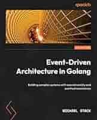

# Event Driven Architecture in Golang

###### 🛠️ *References*
- GitHub: [https://github.com/PacktPublishing/Event-Driven-Architecture-in-Golang](https://github.com/PacktPublishing/Event-Driven-Architecture-in-Golang)

- Mallbots project: [https://github.com/cuongpiger/mallbots](https://github.com/cuongpiger/mallbots)

# ✅ Completed chaps
- [x] [Chapter 1: Introduction to Event-Driven Architectures](./chap01/README.md)
- [x] [Chapter 2: Supporting Patterns in Brief](./chap02/README.md)
- [x] [Chapter 3: Design and Planning](./chap03/README.md)
- [x] [Chapter 4: Event Foundations](./chap04/README.md)
- [x] [Chapter 5: Tracking Changes with Event Sourcing](./chap05/README.md)
- [x] [Chapter 6: Asynchronous Connections](./chap06/README.md)
- [x] [Chapter 7: Event-Carried State Transfer](./chap07/README.md)
- [x] [Chapter 8: Message Workflows](./chap08/README.md)
- [x] [Chapter 9: Transactional Messaging](./chap09/README.md)
